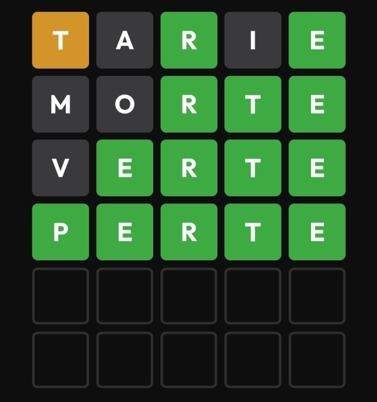

# WORDLE Like Dojo

Le but du Dojo va être de recréer un système équivalent au jeu wordle,
en respectant certaines règles. Ces réèles seront à affiner en début de Dojo.

## Format du Dojo

On se base sur une expérience de Dojo de 1h.

| Durée | Objectif |
|---|---|
| 5 min | Présentation du Dojo et choix des règles |
| 5 min | Définition des règles, choix de dernière minute |
| 40 min | Code |
| 8 min | Rétrospective |
| 2 min | Planification prochain Dojo |

## Règles

> Règles non discutables

- On pratique le TDD
- Un test ```failed``` doit précéder l'écriture du code fonctionnel
- On fonctionne en baby step (on ne code que ce qui est nécessaire pour passer le test)
- On alertene chacun passera  ```co-pilote``` et ```pilote```
- Seul le ```co-pilote``` peut dicter au ```pilote``` ce qui doit être codé
- Seul le ```pilote``` code
- L'assistance peut intervenir pour exprimer son avis sur ce qui est en cours de réalisation, dans ce cas elle s'adresse au ```co-pilote```, le ```pilote``` n'intervient pas
- un maitre du Dojo le ```sensei``` veille à ce que les règles soient respectées, et globalement au bon déroullé du Dojo
- La bienveillance n'est pas optionnelle, aucun jugement sur les personnes, on ne se concentre que sur le code

> Règles optionnelles

Ces règles sont a définir en début de Dojo

- [ ] Pas de type générique
- [ ] DDD principles
- [ ] Réduction des conditionnelles (pas de else)
- [ ] Utilisation Object calisthenics (exemple <https://www.jimmyklein.fr/les-objets-calisthenics/>)
- [ ] TCR (test commit revert)
- [ ] Clavier uniquement (pas de souris)
- [ ] Dark Dojo (le sensei désigne un imposteur qui perturbe le dojo snas se faire demasquer)

## Principes

Pour rappeler le déroulé du Dojo, le principe est simple, il s'agit d'expérimenter un travail collaboratif afin de résoudre une problématique entre profesionnels, sous contraintes.
La finalité n'est pas de réussir à produire le résultat attendu, mais bien d'expérimenter les pratiques de conception logiciel utilisées dans l'Xtrem Programing et plus généralement le Test Driven Development.
Ce qu'il faut retenir, c'est qu'il vaut mieux éviter d'apprendre sur la production, et de s'entrainer en amont sans risque.
Pour donner une image
> c'est commet si un couple qui réalise du patinage artistique construisait sa chorégraphie directement pendant le concours...
> "Je vais te lancer pour que tu fasses un triple boucle et je te rattrape par une lame pour faire un 720°, vas-y on tente, ça va bien se passer"
> Non ces profressionnels s'entrainent avant 😉

## Le Dojo Wordle

comment jouer ?

- Proposez des mots de 5 lettres, en Français (le mot doit être valide).
- Les bonnes lettres au bon endroit seront en vert, les bonnes lettres aux mauvais endroits seront en orange, les mauvaises en grises.
- Vous avez 6 essais pour trouver le bon mot.
- Il n'y a qu'un seul mot par jour à l'échelle mondiale

Exemple de rendu (non obligatoire)



### Principes de jeux

- En tant que joueur, je souhaite pouvoir démarrer une partie afin de jouer au jeu
- En tant que joueur, je dois saisir un mot de 5 lettres qui soit valide (reconnu dans la langue Française) à chaque tour
- En tant que joueur, au 6ieme tour, si je n'ai pas le bon mot, alors la partie est perdu
- En tant que joueur, dès que j'inscris le mot correct, alors la partie est gagnée
- La partie s'arrête si le mot est trouvé ou si le joueur arrive a plus de 6 essai
- En tant que joueur, si une lettre est correctement placée alors j'ai un indicateur qui me leconfirme (quelle lettre, et a quelle place par exmple on peut avoir pour le Perte, avec Tarie, 3 & 5 ok)
- En tant que joueur, si une fait partie du mot, mais n'est pas correctement placée, alors j'ai un indicateur qui me le confirme
- En tant que joueur, si mon mot n'est pas valide, alors je ne peux pas valider ma ligne

## Help

Une liste de 5070 mots de 5 lettres est disponible dans le fichier ```./assets/5_letter_words_FR.txt``` et peut servir de base pour

- Proposer un mot a découvrir
- Vérifier que le mot est valide

Il est possible de changer les couleurs d'affichage de la console

```js
console.log('\x1b[42m\x1b[1m%s1\x1b[40m\x1b[37m%s2', "t", "arie");
```
```%sX``` représente l'argument, ici "t" puis "arie"
```\x1b[40m\x1b[37m``` est le code de couleur, ici fond noir ```x1b[40m``` et couleur blanche de text ```\x1b[37m```

liste de code non exhaustive

```
Reset = "\x1b[0m"
Bright = "\x1b[1m"
Dim = "\x1b[2m"
Underscore = "\x1b[4m"
Blink = "\x1b[5m"
Reverse = "\x1b[7m"
Hidden = "\x1b[8m"

FgBlack = "\x1b[30m"
FgRed = "\x1b[31m"
FgGreen = "\x1b[32m"
FgYellow = "\x1b[33m"
FgBlue = "\x1b[34m"
FgMagenta = "\x1b[35m"
FgCyan = "\x1b[36m"
FgWhite = "\x1b[37m"

BgBlack = "\x1b[40m"
BgRed = "\x1b[41m"
BgGreen = "\x1b[42m"
BgYellow = "\x1b[43m"
BgBlue = "\x1b[44m"
BgMagenta = "\x1b[45m"
BgCyan = "\x1b[46m"
BgWhite = "\x1b[47m"
```


## Outils (pré requis)

Pour le déroulé du Dojo dans de bonne conditions, il vous faut

- Un IDE, je préconise pour ce Dojo l'utilisation VS Code
- Un runtime pour le Code, je préconise pour ce Dojo d'utiliser Node Js (v16.14.0)
- Un outil pour collaborer en temps réel (Duckly ou Live Share sur VS Code par exemple)
- Git (il faudra sans doute un accès au repository créé)
